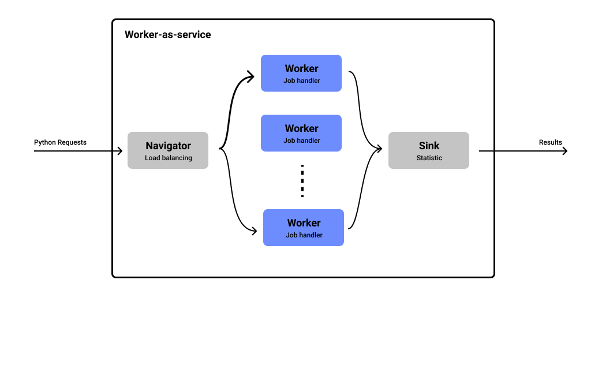
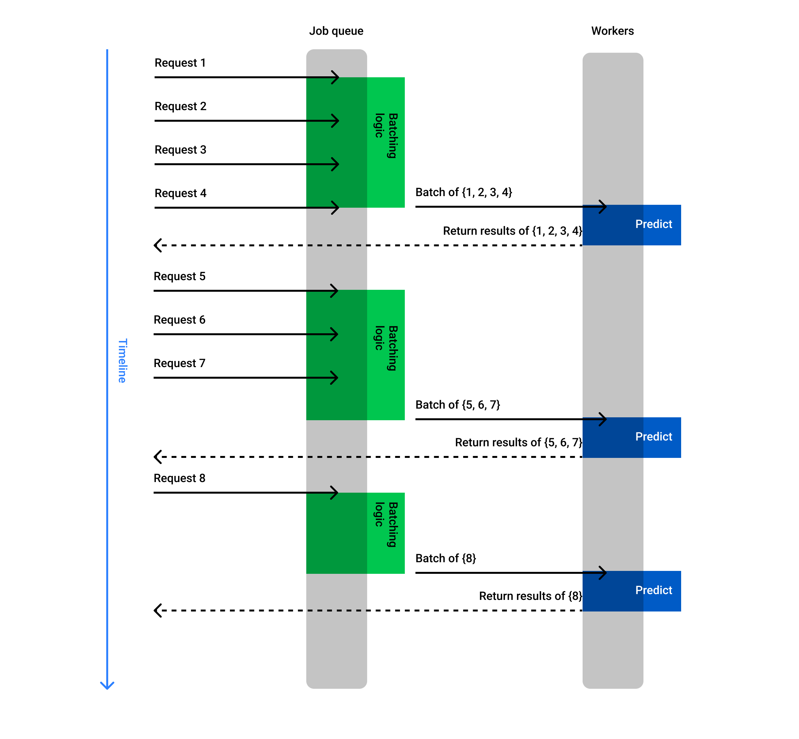
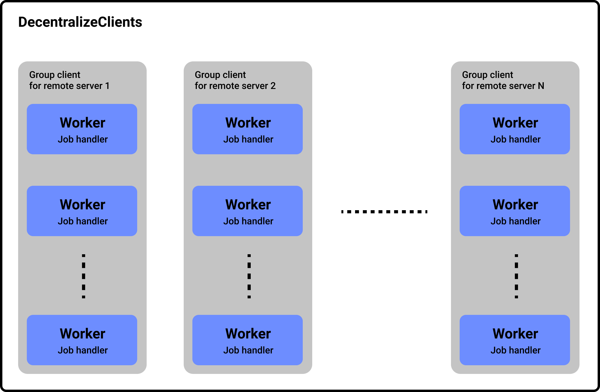

Design concept
========================

Its better to understand the concept of ``worker-as-service``.

.. contents:: :local:

Server side
-----------

Architect
^^^^^^^^^

`worker-as-service` is self-contained with 3 main components:

- ``Navigator``: this is where the service receives request. ``navigator`` will get the request and then forward it to the workers sequentially.

- ``Worker``: main process to do all the logic you assign it to. This module is required to implement as a subclass of ``WKRHardWorker``.

- ``Sink``: this is where the worker push the result to. This module also do some statistic (throughput rate, timing...). Finally, ``Sink`` will send the result back to the client.

Main flow of a request
^^^^^^^^^^^^^^^^^^^^^^

1. ``Navigator`` receives the request, then push it to worker.
2. ``Worker`` receives the request, process it in ``predict`` function. And then push it to ``Sink``.
3. ``Sink`` receives the result, do some statistics and then push result to client.

Batching
^^^^^^^^

This framework support adaptive batching for high performance serving.

Batching logic will based on ``-batch_size`` and ``-batch_group_timeout`` flags when you start the service. When batching logic start, it will loop <``batch_size``> time with maximum ``batch_group_timeout`` milliseconds per loop. Based on this implement, final batch size input to workers will vary from 1 to ``batch_size``. Worker will need to support variable batch size or padding batch itself.

Client side
-----------

Each ``WKRClient`` instance serves as a request client to the server. When you make a new instance, a new ID will be generated to help server identity it.

Decentralize client side
------------------------

When working on high throughput application, **Decentralize client** come in handy. 

``Decentralize`` provides you a tool to managing multiple concurrent group of clients. Each group of clients can connected to different remote servers.

``Decentralize`` also provides CLI to control the computing process without interupting the request and response. Such CLI are:

- ``wkr-decentral-terminate``: safely terminate the ``Decentralize``
- ``wkr-decentral-switch``: safely re-config group of clients.
- ``wkr-decentral-idle``: stop all of clients, put ``Decentralize`` on standby mode.
- ``wkr-decentral-restart``: stop all of clients (if any) and then re create them. 
- ``wkr-decentral-status``: show current config (groups of clients).

.. note:: ``Decentralize`` can be used for other multi process computing purposes 